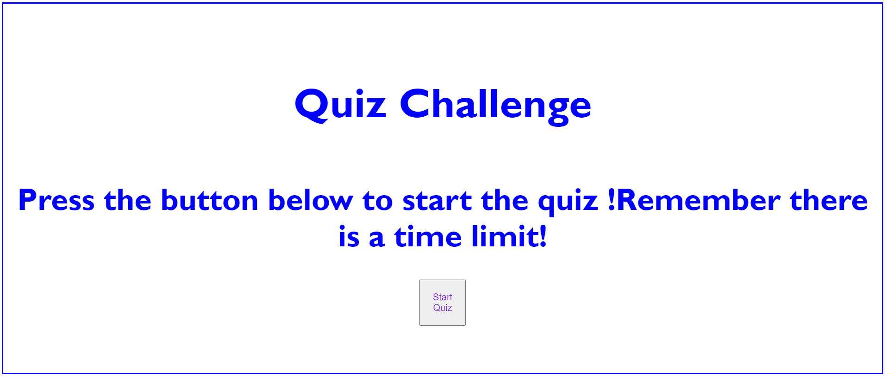

<h1>UW BootCamp Week 4 Challenge<h1> 

<h2>Table of contents<h2>

<ul>
    <li>General information
    <li>Setup 
    <li>License
    <li>Screenshots
    <li>Acceptance Criteria
    <li>Links
<ul>

<h3>
General infromation<h3>
    The Useage of this website is to test the knowledge about the different types of programing languages.
    

<h3>
Setup<h3>`
    This repo contains multiply images along with 2 Html ,1 Css style Sheet,2 javascript ,1 readme.md file and a mit license. 
    
<h3>
License<h3>
This repo uses the MIT license 

Copyright <2022> <MIT HOLDER>

Permission is hereby granted, free of charge, to any person obtaining a copy of this
software and associated documentation files (the "Software"), to deal in the Software
without restriction, including without limitation the rights to use, copy, modify,
merge, publish, distribute, sublicense, and/or sell copies of the Software, and to
permit persons to whom the Software is furnished to do so.

THE SOFTWARE IS PROVIDED "AS IS", WITHOUT WARRANTY OF ANY KIND, EXPRESS OR IMPLIED,
INCLUDING BUT NOT LIMITED TO THE WARRANTIES OF MERCHANTABILITY, FITNESS FOR A
PARTICULAR PURPOSE AND NONINFRINGEMENT. IN NO EVENT SHALL THE AUTHORS OR COPYRIGHT
HOLDERS BE LIABLE FOR ANY CLAIM, DAMAGES OR OTHER LIABILITY, WHETHER IN AN ACTION
OF CONTRACT, TORT OR OTHERWISE, ARISING FROM, OUT OF OR IN CONNECTION WITH THE
SOFTWARE OR THE USE OR OTHER DEALINGS IN THE SOFTWARE.

<h3>
Screenshots<h3>
Below is a screesnshot of how the website should look

Below is another screenshot of how the actual deployed website looks like

)

<h3>
Accetance Criteria<h3>
GIVEN I am taking a code quiz
WHEN I click the start button
THEN a timer starts and I am presented with a question
WHEN I answer a question
THEN I am presented with another question
WHEN I answer a question incorrectly
THEN time is subtracted from the clock
WHEN all questions are answered or the timer reaches 0
THEN the game is over
WHEN the game is over
THEN I can save my initials and score

<h3>
Links<h3>
Below is a link to the actual deployed application
 